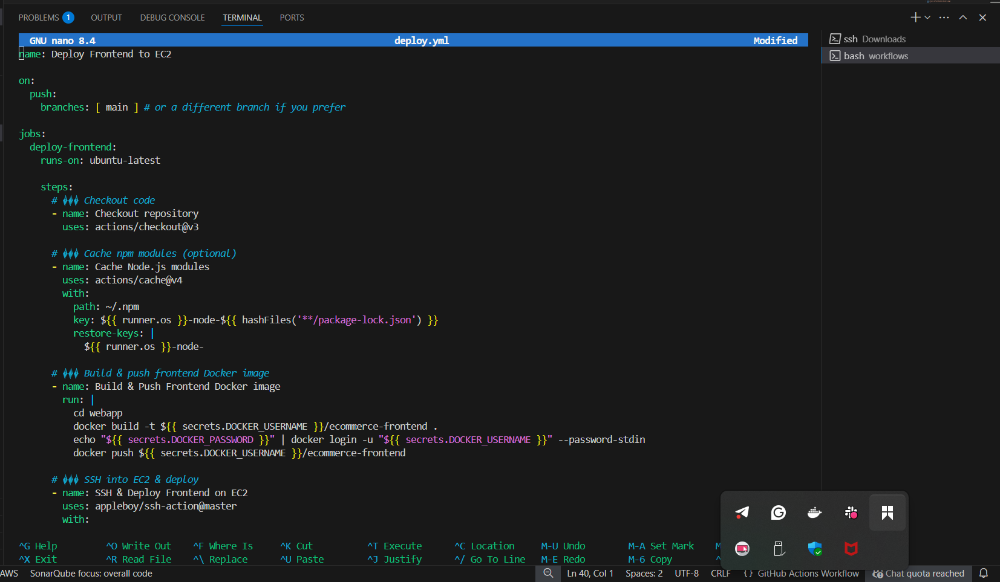

# 📦 E-commerce Application — CI/CD Project
## 📦Ecommerce with Github Actions


## 🌟 Project Objectives
🎯 Build an **Ecommerce platform** with both backend and frontend components.  
🎯 Implement a CI/CD pipeline using GitHub Actions to automatically build, test, and deploy both components.  
🎯 Containerize applications using Docker and deploy them to an AWS EC2 instance.  
🎯 Learn and demonstrate DevOps best practices: automation, reproducibility, and infrastructure as code.

---

## Project Summary

This project demonstrates a complete CI/CD pipeline for deploying an E-commerce web application with separate backend and frontend components.
The solution leverages GitHub Actions to automate the build, test, and deployment process. When code is pushed to the main branch, GitHub Actions builds Docker images for both the backend and frontend, pushes them to Docker Hub, connects via SSH to an AWS EC2 instance, and deploys updated containers.
This implementation showcases modern DevOps practices such as containerization, infrastructure automation, and continuous delivery to ensure fast, reliable, and reproducible deployments.


## 📝 Prerequisites

Before starting, make sure you have:
✅ Basic knowledge of **Node.js**, **Docker**, and **GitHub Actions**.  
✅ A working **AWS EC2 instance** (Ubuntu) with SSH access.  
✅ SSH key pair (`.pem` private key & corresponding public key added to EC2).  
✅ A **Docker Hub account** to push images.  
✅ A GitHub repository to host your code & workflows.

---

## 🚀 Live Demo

- **Frontend:** http://13.61.32.215
- **Backend API:** http://13.61.32.215:3000

---

## 🛠️ Tech Stack

- Node.js (Backend & Frontend)
- Express
- React (or your frontend framework)
- Docker
- GitHub Actions
- AWS EC2
- Docker Hub

---

## 📄 CI/CD Pipeline Overview

| Component  | Trigger | Actions |
|------------|---------|---------|
| **Backend** | Push to `main` | Build & push Docker image → SSH to EC2 → Deploy container |
| **Frontend** | Push to `main` | Build & push Docker image → SSH to EC2 → Deploy container |

✅ Fully automated — no manual steps once configured.

---


## 🚀 Step-by-Step Process

###  Step 1: Created & Cloned Github repo named **ecommerce-platform**

* 


>> Cloned into the repository

* 


>> Mkdir API & WEBAPP

* 

### 📁 Step 2: Project Setup

- Create a Node.js backend and a frontend app (React or similar).
- Place frontend code in a `webapp/` folder.
- Write a `Dockerfile` for each app.

* 
---

### 🔗 Step 3: Set Up EC2 Instance

- Launch an Ubuntu EC2 instance on AWS.
- SSH into your server:
  ```bash
   ssh -i "recovery-key.pem" ubuntu@ec2-13-61-32-215.eu-north-1.compute.amazonaws.com
   ```
   * 

- sudo apt update
- sudo apt install docker.io -y
- sudo usermod -aG docker ubuntu

* 
* 


>> Upload your SSH public key to ~/.ssh/authorized_keys.

 * 


### 🐳 Step 4: Set Up Docker Hub

>> Created a Docker Hub account.

>> Created repositories for ecommerce-backend and ecommerce-frontend.

>> Generated your username & password.

* 


### 🔐 Step 5: Configure GitHub Secrets

In your GitHub repo:

Go to: ⚙️ Settings → Secrets → Actions → New Repository Secret.

Add the following:

Name | Value
EC2_HOST	| Public IP of your EC2
EC2_SSH_KEY	| Private SSH key content
DOCKER_USERNAME	| Your Docker Hub username
DOCKER_PASSWORD	| Your Docker Hub password

* 


### 🔗 Step 6: Created Github Workflows

* Wrote two workflow YAML files under .github/workflows/:

>> deploy-backend.yml

>> deploy-frontend.yml

* 

* 

>> Github Actions

* 


### 🧪 Step 7: Pushed Code & Trigger CI/CD

>> Pushed your code to main branch.

GitHub Actions will:
✅ Build Docker images
✅ Push to Docker Hub
✅ SSH to EC2
✅ Pull & run containers

* 

* 


### 🌐 Step 8: Verified Deployment

Open browser:

Frontend: http://3.61.32.215/

Backend: http://13.61.32.215:3000

Or test with:

bash
```
curl http://13.61.32.215:3000
```

* 


 ###  👤 Author

GitHub: Samuel Oluwatobi Olofinkuade

 ### Github Repository

https://github.com/Techytobii/ecommerce-platform.git
